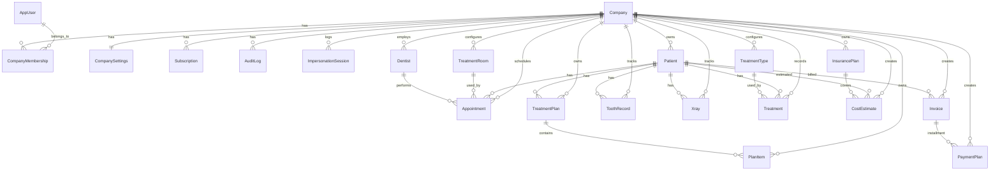

# DentalSaaS ERD

```mermaid
erDiagram
    AppUser ||--o{ CompanyMembership : belongs_to
    Company ||--o{ CompanyMembership : has

    Company ||--|| CompanySettings : has
    Company ||--o{ Subscription : has
    Company ||--o{ AuditLog : has
    Company ||--o{ ImpersonationSession : logs

    Company ||--o{ Patient : owns
    Company ||--o{ TreatmentType : configures
    Company ||--o{ TreatmentRoom : configures
    Company ||--o{ Dentist : employs
    Company ||--o{ Appointment : schedules
    Company ||--o{ TreatmentPlan : owns
    Company ||--o{ PlanItem : owns
    Company ||--o{ ToothRecord : tracks
    Company ||--o{ Xray : tracks
    Company ||--o{ Treatment : records
    Company ||--o{ InsurancePlan : owns
    Company ||--o{ CostEstimate : creates
    Company ||--o{ Invoice : creates
    Company ||--o{ PaymentPlan : creates

    Patient ||--o{ ToothRecord : has
    Patient ||--o{ Xray : has
    Patient ||--o{ Treatment : has
    Patient ||--o{ TreatmentPlan : has
    Patient ||--o{ Appointment : has
    Patient ||--o{ Invoice : billed
    Patient ||--o{ CostEstimate : estimated

    TreatmentType ||--o{ Treatment : used_by
    TreatmentRoom ||--o{ Appointment : used_by
    Dentist ||--o{ Appointment : performs
    TreatmentPlan ||--o{ PlanItem : contains
    InsurancePlan ||--o{ CostEstimate : covers
    Invoice ||--o{ PaymentPlan : installment
```
